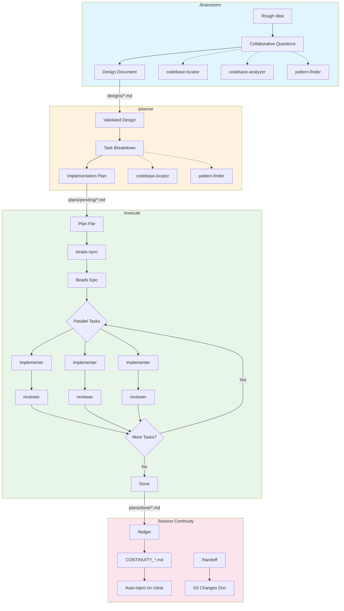

# claude-ledger

Structured **Brainstorm → Plan → Implement** workflow with session continuity.

## Installation

### From Marketplace

```bash
claude plugin install claude-ledger
```

### From Source

```bash
git clone https://github.com/StevenBock/claude-ledger.git ~/.claude/plugins/claude-ledger
cd ~/.claude/plugins/claude-ledger
npm install
npm run build
```

Then add to your settings:

```json
{
  "plugins": ["~/.claude/plugins/claude-ledger"]
}
```

## Workflow



Research skills (codebase-locator, codebase-analyzer, pattern-finder) are spawned within brainstorm and plan phases.

### 1. Brainstorm

Refine rough ideas into fully-formed designs through collaborative questioning.

- One question at a time
- 2-3 approaches with trade-offs
- Section-by-section validation
- Spawns research skills to understand codebase
- Output: `thoughts/shared/designs/YYYY-MM-DD-{topic}-design.md`

### 2. Plan

Transform validated designs into comprehensive implementation plans.

- Spawns research skills for exact paths, signatures, patterns
- Bite-sized tasks (2-5 minutes each)
- Exact file paths, complete code examples
- TDD workflow: failing test → verify fail → implement → verify pass → commit
- Output: `thoughts/shared/plans/pending/YYYY-MM-DD-{topic}.md`

### 3. Implement

Execute plan with Beads-integrated parallel execution:

- Moves plan from `pending/` → `active/` → `done/`
- Syncs tasks to Beads for dependency tracking
- Executes tasks in parallel (MAX_PARALLEL=4) using blocking mode
- Per-task implementer → reviewer cycle
- Updates Beads status as tasks complete
- Max 3 cycles per task before blocking
- Output: Beads epic with task status

### 4. Session Continuity

Maintain context across clears with structured compaction:

```
/ledger
```

Creates/updates `thoughts/ledgers/CONTINUITY_{session-name}.md` with:
- Goal and constraints
- Progress tracking (Done/In Progress/Blocked)
- Key decisions with rationale
- File operations (automatically tracked)
- Next steps

The ledger is automatically injected on `/clear`, `/resume`, or context compaction.

### 5. Handoffs

Generate git-aware handoff documents for session transitions:

```
/handoff [name]
```

Creates `thoughts/shared/handoffs/YYYY-MM-DD-{name}.md` with:
- Git commits since session start
- Files changed (added/modified/deleted)
- Uncommitted changes
- Session context from ledger

## Commands

| Command | Description |
|---------|-------------|
| `/brainstorm` | Refine ideas into designs through collaborative questioning |
| `/planner` | Create detailed implementation plan from a validated design |
| `/approve` | Save plan to thoughts folder and start executor |
| `/save-plan` | Save plan to thoughts folder without executing |
| `/execute` | Execute an implementation plan with parallel task batching |
| `/plans [n\|active\|done\|all]` | List plans or execute plan #n from pending |
| `/ledger` | Create or update continuity ledger |
| `/handoff [name]` | Generate handoff document with git changes |
| `/search` | Search past plans and ledgers |

## Skills

| Skill | Purpose |
|-------|---------|
| `brainstorm` | Design exploration through questioning |
| `planner` | Create detailed implementation plans |
| `executor` | Execute plan with Beads-integrated parallel batching |
| `beads-sync` | Convert plan file to Beads dependency graph |
| `implementer` | Execute single task from plan |
| `reviewer` | Review implementation correctness |
| `codebase-locator` | Find WHERE files are |
| `codebase-analyzer` | Explain HOW code works |
| `pattern-finder` | Find existing patterns to follow |

## Hooks

| Hook | Event | Description |
|------|-------|-------------|
| git-snapshot-capture | SessionStart | Capture git state for handoffs |
| ledger-loader | SessionStart | Inject ledger on resume/clear/compact |
| context-injector | SessionStart | Inject additional context |
| batch-handoff-enforcer | PreToolUse (Task) | Block batch N+1 until batch N handoff exists |
| file-ops-tracker | PostToolUse | Track read/write operations |
| plan-lifecycle | PostToolUse (Read/Edit) | Auto-move plans pending→active→done |
| comment-checker | PostToolUse (Edit) | Warn about unnecessary comments |
| artifact-auto-index | PostToolUse (Write) | Index plans and ledgers |
| plan-copier | PostToolUse (ExitPlanMode) | Copy plan to pending/ folder |
| decision-capture | PostToolUse (AskUserQuestion) | Capture decisions to decisions.json |
| auto-save-ledger | PreCompact | Save file ops + decisions before compact |

## MCP Servers

| Server | Description |
|--------|-------------|
| context7 | Documentation lookup |
| artifact-index | Full-text search across plans and ledgers |

### Artifact Index Tools

The `artifact-index` MCP server provides:

- **artifact_search** - Full-text search across indexed plans and ledgers
- **artifact_index** - Index a plan or ledger file
- **artifact_list** - List all indexed artifacts

Database stored at: `~/.config/claude-code/artifact-index/context.db`

## Structure

```
claude-ledger/
├── .claude-plugin/
│   └── plugin.json         # Plugin manifest
├── .mcp.json               # MCP server config
├── commands/               # Slash commands
│   ├── approve.md
│   ├── brainstorm.md
│   ├── execute.md
│   ├── handoff.md
│   ├── ledger.md
│   ├── planner.md
│   ├── plans.md
│   ├── save-plan.md
│   └── search.md
├── skills/                 # Agent skills
│   ├── beads-sync/
│   ├── brainstorm/
│   ├── codebase-analyzer/
│   ├── codebase-locator/
│   ├── executor/
│   ├── implementer/
│   ├── pattern-finder/
│   ├── planner/
│   └── reviewer/
├── hooks/                  # Event hooks
│   ├── hooks.json
│   ├── src/               # TypeScript sources
│   └── dist/              # Compiled JS
├── servers/               # MCP servers
│   └── artifact-index/
│       ├── src/           # TypeScript sources
│       └── dist/          # Compiled JS
└── thoughts/              # Artifacts (gitignored)
    ├── ledgers/
    └── shared/
        ├── designs/
        ├── handoffs/
        └── plans/
            ├── pending/   # New plans
            ├── active/    # Currently executing
            └── done/      # Completed
```

## Development

```bash
npm install
npm run build      # Build hooks
npm run typecheck  # Type check
```

## Philosophy

1. **Brainstorm first** - Refine ideas before coding
2. **Research before implementing** - Understand the codebase
3. **Plan with human buy-in** - Get approval before coding
4. **Parallel investigation** - Spawn multiple skills for speed
5. **Continuous verification** - Implementer + Reviewer per task
6. **Session continuity** - Never lose context across clears

## Credits

Based on [micode](https://github.com/vtemian/micode) OpenCode plugin.

Built on techniques from:
- [HumanLayer ACE-FCA](https://github.com/humanlayer/12-factor-agents) - Research → Plan → Implement methodology
- [Factory.ai Context Compression](https://factory.ai/blog/context-compression) - Structured compaction research
